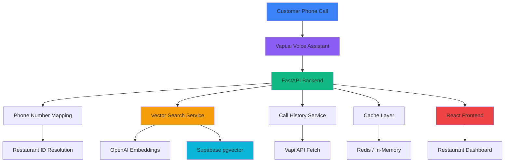

# CallEats: AI-Powered Restaurant Voice Assistant

Multi-tenant voice assistant system for restaurants using Vapi.ai, semantic search, and real-time call management.

## Overview

Restaurants receive countless phone calls asking about menu items, hours, delivery zones, and availability. Staff spend hours answering repetitive questions, leading to missed calls during peak hours and inconsistent information delivery.

CallEats automates restaurant phone interactions through an AI voice assistant powered by Vapi.ai. The system uses semantic search with OpenAI embeddings and pgvector to provide accurate, restaurant-specific answers to customer queries in natural conversation.

## Key Capabilities

| Capability                       | Description                                                                                             |
| -------------------------------- | ------------------------------------------------------------------------------------------------------- |
| **Multi-Tenant Voice Assistant** | Shared Vapi.ai assistant routes calls to correct restaurants using phone number mapping                 |
| **Semantic Knowledge Base**      | Vector similarity search using OpenAI embeddings (text-embedding-3-small, 1536 dimensions) and pgvector |
| **Real-Time Call Management**    | Automatic call tracking with fallback mechanisms for unreliable webhooks                                |
| **Intelligent Caching**          | Redis-based distributed caching (60s TTL) with in-memory fallback                                       |
| **Production Architecture**      | FastAPI backend, React frontend, comprehensive middleware stack                                         |

## System Architecture



## Technical Approach

### Multi-Tenant Design

All data scoped by `restaurant_id`:

- Row-level security (RLS) in Supabase
- Restaurant-scoped vector search
- Isolated call history and menu data
- Phone number → restaurant_id mapping for call routing

### Voice Assistant Integration

Vapi.ai handles voice interaction:

- Function tools: `get_menu_info`, `get_modifiers_info`, `get_hours_info`, `get_zones_info`
- Natural conversation with GPT-4o-mini
- Restaurant-specific responses via metadata injection
- Webhook reliability with scheduled API fetches

### Vector Search Pipeline

1. **Query Processing**: Extract user query from Vapi tool call
2. **Embedding Generation**: Generate OpenAI embedding for query
3. **Vector Search**: pgvector cosine similarity search with restaurant_id filter
4. **Result Formatting**: Return top 5 results with metadata for TTS enhancement
5. **Caching**: Store results with 60-second TTL

### Call Data Management

Dual mechanism for call tracking:

- **Webhook Events**: `assistant-request`, `status-update`, `end-of-call-report`
- **Scheduled API Fetch**: Background thread fetches call data 30 seconds after detection
- **Fallback Protection**: Ensures complete call data even if webhooks fail

## Technology Stack

| Component            | Technology                    | Purpose                               |
| -------------------- | ----------------------------- | ------------------------------------- |
| **Backend**          | FastAPI, Python 3.12          | REST API with async support           |
| **Voice AI**         | Vapi.ai, GPT-4o-mini          | Voice assistant and conversation      |
| **Embeddings**       | OpenAI text-embedding-3-small | Semantic search vectorization         |
| **Vector DB**        | Supabase pgvector             | Vector similarity search              |
| **Database**         | Supabase PostgreSQL           | Multi-tenant data storage             |
| **Cache**            | Redis / cachetools            | Distributed caching with fallback     |
| **Frontend**         | React, TypeScript, Vite       | Restaurant management dashboard       |
| **State Management** | React Query (TanStack Query)  | Server state and caching              |
| **Styling**          | Tailwind CSS                  | Responsive UI components              |
| **Error Tracking**   | Sentry                        | Production error monitoring           |
| **Authentication**   | JWT, Supabase Auth            | User authentication and authorization |

## Key Features

### Restaurant Dashboard

- Real-time call statistics (calls today, menu items, categories, phone status)
- Recent call history with transcripts
- Quick actions for common tasks

### Menu Builder

- Category management with display ordering
- Menu item CRUD with modifiers
- Image uploads for menu items
- Search and filter functionality

### Call History

- Complete call transcripts (user/assistant messages only)
- Call metadata (duration, cost, outcome, caller)
- Filtering and search

### Delivery Zones

- Geographic zone definition with Leaflet maps
- Delivery fee and minimum order configuration
- Zone visualization and editing

### Operating Hours

- Day-of-week scheduling
- Open/close time configuration
- Closed day handling

## Infrastructure

**Backend**: Railway (FastAPI service)  
**Frontend**: Vercel (React SPA)  
**Database**: Supabase (PostgreSQL with pgvector)  
**Cache**: Railway Redis (optional, falls back to in-memory)  
**Voice**: Vapi.ai (voice assistant platform)  
**Monitoring**: Sentry (error tracking)

## Getting Started

### Prerequisites

- Python 3.12+
- Node.js 18+
- Supabase account
- Vapi.ai account
- OpenAI API key
- Redis (optional, for distributed caching)

### Backend Setup

```bash
cd backend
pip install -r requirements.txt
cp env.example .env
# Configure environment variables
uvicorn restaurant_voice_assistant.main:app --reload
```

### Frontend Setup

```bash
cd frontend
npm install
npm run dev
```

### Database Migration

Run migrations in order:

1. `001_initial_schema.sql` - Core schema with pgvector
2. `002_phone_mappings.sql` - Phone number routing
3. `003_users_table.sql` - User authentication
4. `004_delivery_zones_geometry.sql` - Geographic zones
5. `005_menu_items_image_url.sql` - Image support

### Vapi Configuration

Use `scripts/setup_vapi.py` to configure Vapi.ai assistant with function tools and webhook endpoints.

## Use Cases

- **Menu Inquiries**: "What's on your menu?", "Do you have vegetarian options?"
- **Pricing Questions**: "How much is the pizza?", "What's the price for delivery?"
- **Hours Information**: "When are you open?", "Are you open on Sundays?"
- **Delivery Coverage**: "Do you deliver to downtown?", "What's the delivery fee?"
- **Modifier Questions**: "What can I add to my burger?", "Do you have extra cheese?"

## Key Differentiators

1. **Multi-Tenant Architecture**: Shared assistant instance with isolated restaurant data
2. **Semantic Search**: Vector similarity search for natural language queries
3. **Production-Ready**: Comprehensive error handling, rate limiting, monitoring
4. **Webhook Reliability**: Fallback mechanisms ensure complete call data
5. **Real-Time Updates**: Automatic embedding regeneration on menu changes
6. **Scalable Caching**: Redis-based distributed caching with graceful fallback

## Performance Characteristics

- **Search Latency**: 200-500ms average (with cache), 1-2s (cache miss)
- **Embedding Generation**: 100-300ms per query
- **Vector Search**: 50-200ms (pgvector HNSW index)
- **Cache Hit Rate**: 60-80% for repeated queries
- **Call Data Fetch**: 2-5s for complete call retrieval

## Security

- JWT authentication for frontend API access
- X-Vapi-Secret header validation for webhooks
- Row-level security (RLS) in Supabase
- Rate limiting per user/endpoint
- Request validation and timeout protection
- Security headers middleware (CORS, CSP, etc.)

## Documentation

- [Architecture Documentation](./docs/architecture.md)
- [API Reference](./docs/api.md)

---

**Status**: Production-ready portfolio project demonstrating multi-tenant voice AI architecture
