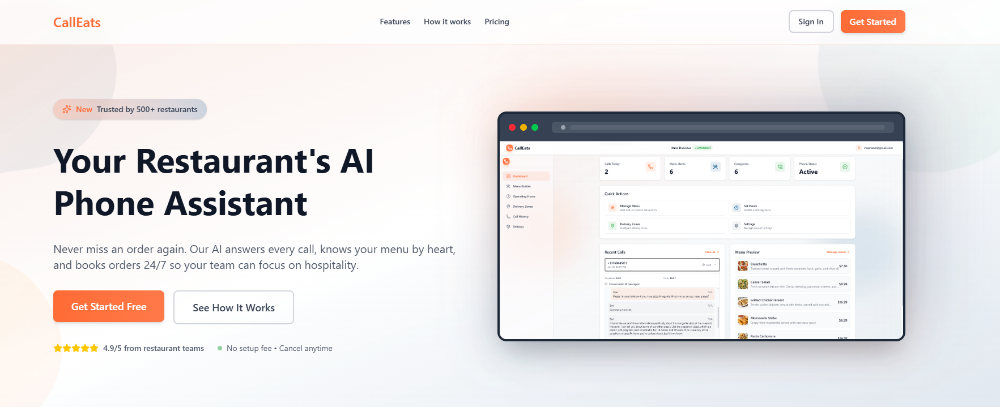
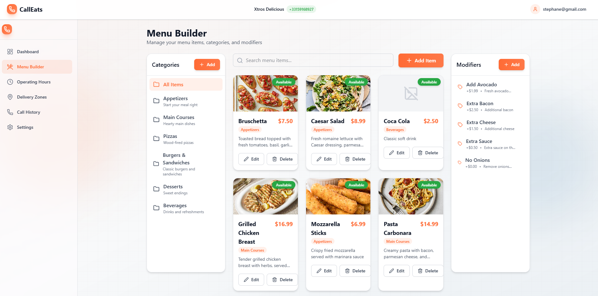
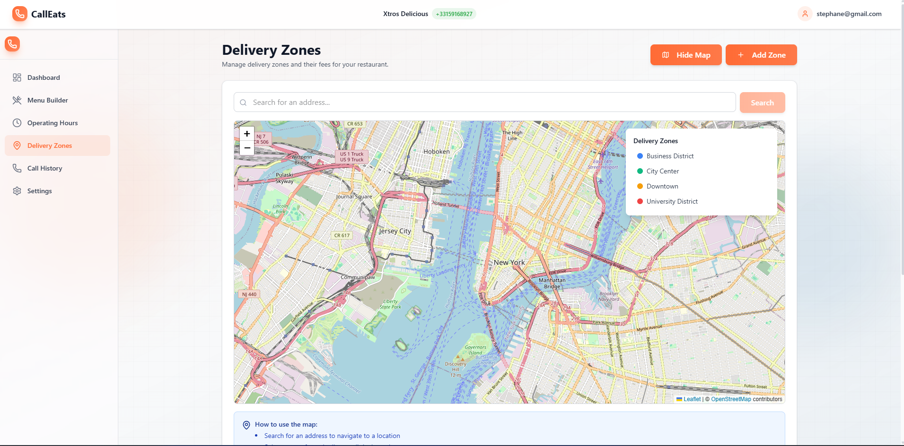
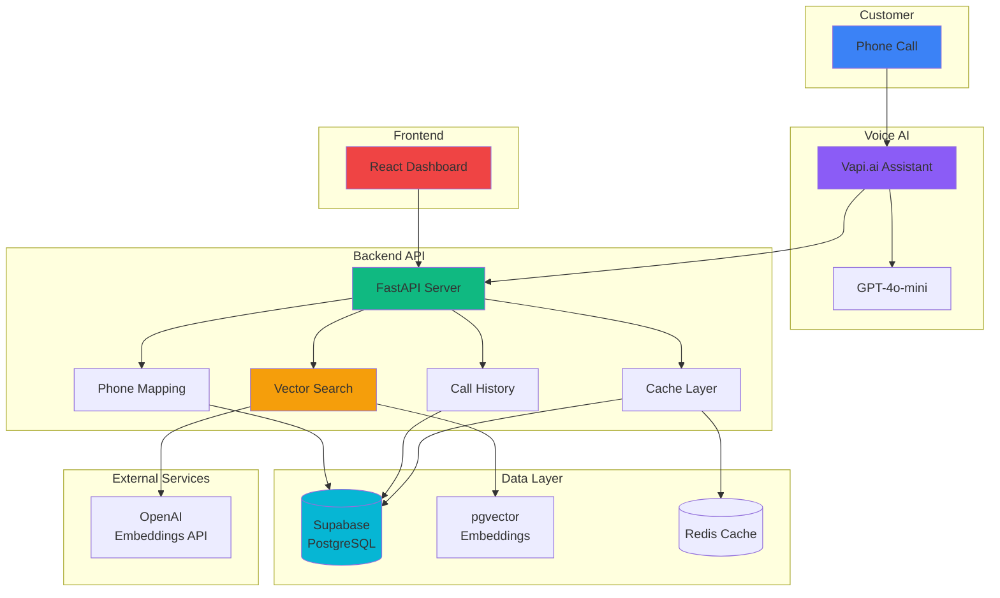

# CallEats: AI-Powered Restaurant Voice Assistant

Multi-tenant voice assistant system for restaurants using Vapi.ai, semantic search, and real-time call management.

## Screenshots

<div align="center">

<table>
<tr>
<td width="50%" align="center">
<strong>Hero / Overview</strong><br/>

</td>
<td width="50%" align="center">
<strong>Dashboard with Call History</strong><br/>

</td>
</tr>
<tr>
<td width="50%" align="center">
<strong>Menu Management Interface</strong><br/>

</td>
<td width="50%" align="center">
<strong>Delivery Zones Configuration</strong><br/>

</td>
</tr>
</table>

</div>

## Overview

AI-powered voice assistant for restaurants that automates phone inquiries using Vapi.ai and semantic search. Handles menu questions, hours, delivery zones, and availability through natural conversation.

## Key Capabilities

| Capability                       | Description                                                                                             |
| -------------------------------- | ------------------------------------------------------------------------------------------------------- |
| **Multi-Tenant Voice Assistant** | Shared Vapi.ai assistant routes calls to correct restaurants using phone number mapping                 |
| **Semantic Knowledge Base**      | Vector similarity search using OpenAI embeddings (text-embedding-3-small, 1536 dimensions) and pgvector |
| **Real-Time Call Management**    | Automatic call tracking with fallback mechanisms for unreliable webhooks                                |
| **Intelligent Caching**          | Redis-based distributed caching (60s TTL) with in-memory fallback                                       |
| **Production Architecture**      | FastAPI backend, React frontend, comprehensive middleware stack                                         |

## System Architecture



## Technical Approach

**Multi-Tenant**: All data scoped by `restaurant_id` with RLS policies and isolated vector search.

**Voice Integration**: Vapi.ai function tools (`get_menu_info`, `get_modifiers_info`, `get_hours_info`, `get_zones_info`) route to restaurant-specific data.

**Vector Search**: OpenAI embeddings → pgvector similarity search → cached results (60s TTL).

**Call Tracking**: Webhook events + scheduled API fetch fallback for reliability.

## Technology Stack

| Component            | Technology                    | Purpose                               |
| -------------------- | ----------------------------- | ------------------------------------- |
| **Backend**          | FastAPI, Python 3.12          | REST API with async support           |
| **Voice AI**         | Vapi.ai, GPT-4o-mini          | Voice assistant and conversation      |
| **Embeddings**       | OpenAI text-embedding-3-small | Semantic search vectorization         |
| **Vector DB**        | Supabase pgvector             | Vector similarity search              |
| **Database**         | Supabase PostgreSQL           | Multi-tenant data storage             |
| **Cache**            | Redis / cachetools            | Distributed caching with fallback     |
| **Frontend**         | React, TypeScript, Vite       | Restaurant management dashboard       |
| **State Management** | React Query (TanStack Query)  | Server state and caching              |
| **Styling**          | Tailwind CSS                  | Responsive UI components              |
| **Error Tracking**   | Sentry                        | Production error monitoring           |
| **Authentication**   | JWT, Supabase Auth            | User authentication and authorization |

## Key Features

- **Dashboard**: Real-time call stats, recent history, quick actions
- **Menu Builder**: Category/item management, modifiers, image uploads
- **Call History**: Complete transcripts, metadata, filtering
- **Delivery Zones**: Geographic zones with Leaflet maps, fee configuration
- **Operating Hours**: Day-of-week scheduling, open/close times

## Infrastructure

| Service    | Platform      | Purpose                                |
| ---------- | ------------- | -------------------------------------- |
| Backend    | Railway       | FastAPI service                        |
| Frontend   | Vercel        | React SPA                              |
| Database   | Supabase      | PostgreSQL + pgvector                  |
| Cache      | Railway Redis | Distributed cache (in-memory fallback) |
| Voice      | Vapi.ai       | Voice assistant platform               |
| Monitoring | Sentry        | Error tracking                         |

## Getting Started

### Prerequisites

- Python 3.12+
- Node.js 18+
- Supabase account
- Vapi.ai account
- OpenAI API key
- Redis (optional, for distributed caching)

### Backend Setup

```bash
cd backend
pip install -r requirements.txt
cp env.example .env
# Configure environment variables
uvicorn restaurant_voice_assistant.main:app --reload
```

### Frontend Setup

```bash
cd frontend
npm install
npm run dev
```

### Database Migration

Run migrations in order:

1. `001_initial_schema.sql` - Core schema with pgvector
2. `002_phone_mappings.sql` - Phone number routing
3. `003_users_table.sql` - User authentication
4. `004_delivery_zones_geometry.sql` - Geographic zones
5. `005_menu_items_image_url.sql` - Image support

### Vapi Configuration

Use `scripts/setup_vapi.py` to configure Vapi.ai assistant with function tools and webhook endpoints.

## Use Cases

Menu inquiries, pricing questions, hours information, delivery coverage, modifier questions.

## Key Differentiators

1. Multi-tenant architecture with shared assistant instance
2. Semantic search via vector similarity
3. Production-ready with error handling, rate limiting, monitoring
4. Webhook reliability with API fetch fallback
5. Real-time embedding updates on menu changes
6. Scalable Redis caching with graceful fallback

## Performance

- Search: 200-500ms (cached), 1-2s (cache miss)
- Embeddings: 100-300ms per query
- Vector search: 50-200ms (HNSW index)
- Cache hit rate: 60-80%
- Call data fetch: 2-5s

## Security

JWT auth, webhook secret validation, RLS policies, rate limiting, request validation, security headers.

## Documentation

- [Architecture Documentation](./docs/architecture.md)
- [API Reference](./docs/api.md)

---

**Status**: Production-ready portfolio project demonstrating multi-tenant voice AI architecture
