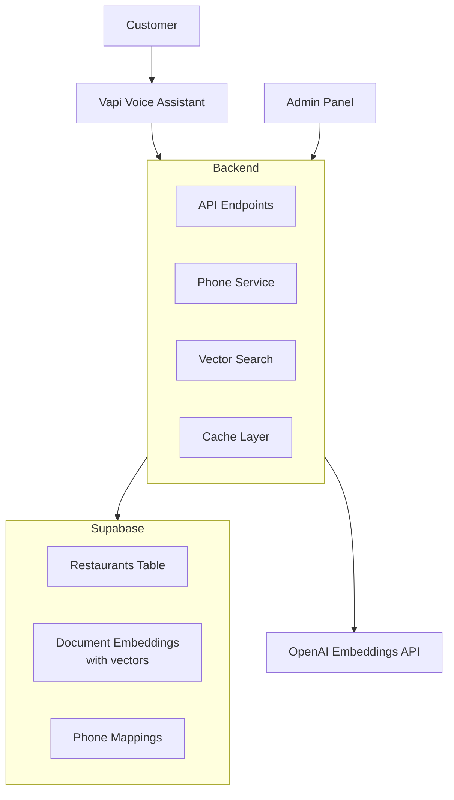

# Restaurant Voice Assistant Backend

Multi-tenant voice assistant backend for restaurants using Vapi.ai, FastAPI, Supabase (pgvector), and OpenAI embeddings.

## Features

- **Multi-tenancy**: Data isolation per restaurant using `restaurant_id`
- **Dual Authentication**: JWT (frontend users) + X-Vapi-Secret (webhooks/admin)
- **Voice Integration**: Vapi.ai voice assistant with function tools
- **Vector Search**: Semantic search using pgvector and OpenAI embeddings
- **Spatial Queries**: PostGIS integration for delivery zone boundary checking
- **Category Management**: Structured menu categories (replaces free-form text)
- **Modifier Linking**: Many-to-many relationships between menu items and modifiers
- **Automated Phone Provisioning**: Programmatic Twilio phone number assignment
- **Cost-Efficient**: Single shared Vapi assistant for all restaurants
- **Caching**: In-memory caching for frequently accessed data

## Quick Start

1. **Setup Environment**: Copy `.env.example` to `.env` and configure variables (see [Environment Variables](docs/ENVIRONMENT_VARIABLES.md))
2. **Database Setup**: Run migrations in Supabase SQL Editor (see [Setup Guide](docs/SETUP.md#database-setup))
3. **Run Locally**: `docker-compose up`
4. **Configure Vapi**: `docker-compose exec api python -m scripts.setup_vapi`
5. **Create Restaurant**: Use frontend or API to create restaurants and manage data

See [Setup Guide](docs/SETUP.md) for detailed instructions.

## Architecture



## Documentation

- **[Setup Guide](docs/SETUP.md)** - Detailed setup instructions
- **[Architecture](docs/ARCHITECTURE.md)** - System design and data flows
- **[API Reference](docs/API.md)** - Endpoint documentation
- **[Environment Variables](docs/ENVIRONMENT_VARIABLES.md)** - Configuration reference
- **[Phone Number Automation](docs/PHONE_NUMBER_AUTOMATION.md)** - Twilio integration guide
- **[Production Deployment](docs/PRODUCTION.md)** - Production deployment guide and best practices
- **[Vapi Troubleshooting](docs/VAPI_TROUBLESHOOTING.md)** - Known Vapi API issues and solutions

## Tech Stack

- **FastAPI** - Web framework
- **Supabase** - PostgreSQL with pgvector extension
- **OpenAI** - Embeddings (text-embedding-3-small)
- **Vapi.ai** - Voice AI platform
- **Twilio** - Phone number provisioning
- **Docker** - Containerization

## API Endpoints

**Core:**

- `POST /api/restaurants` - Create restaurant (auto-assigns phone)
- `GET /api/restaurants/{id}` - Get restaurant details
- `PUT /api/restaurants/{id}` - Update restaurant
- `GET /api/restaurants/{id}/phone` - Get phone details
- `POST /api/restaurants/{id}/phone/test` - Test phone connectivity
- `GET /api/calls` - List call history
- `GET /api/calls/{id}` - Get call details

**Authentication:**

- `POST /api/auth/register` - Register user
- `POST /api/auth/login` - Login (returns JWT)
- `GET /api/auth/me` - Get current user

**Menu Management:**

- `GET/POST/PUT/DELETE /api/restaurants/{id}/menu-items` - Menu items CRUD
- `GET/POST/DELETE /api/restaurants/{id}/menu-items/{item_id}/modifiers` - Link modifiers to items
- `GET/POST/PUT/DELETE /api/restaurants/{id}/categories` - Categories CRUD
- `GET/POST/PUT/DELETE /api/restaurants/{id}/modifiers` - Modifiers CRUD

**Operations:**

- `GET /api/restaurants/{id}/hours` - List operating hours
- `GET /api/restaurants/{id}/hours/{hour_id}` - Get single operating hour
- `PUT /api/restaurants/{id}/hours` - Bulk update all hours
- `DELETE /api/restaurants/{id}/hours` - Delete all hours
- `GET/POST/PUT/DELETE /api/restaurants/{id}/zones` - Delivery zones
- `GET /api/restaurants/{id}/zones/check` - Check if point is in zone (PostGIS)
- `POST /api/restaurants/{id}/zones/{zone_id}/boundary` - Set zone boundary (GeoJSON)
- `GET /api/restaurants/{id}/zones/{zone_id}/map` - Get zone as GeoJSON

**Vapi Webhooks:**

- `POST /api/vapi/server` - Unified webhook (assistant-request, end-of-call-report)
- `POST /api/vapi/knowledge-base` - Tool calls handler

See [API Reference](docs/API.md) for complete documentation.

## Project Structure

```
backend/
├── src/                    # Application code
│   ├── core/              # Core infrastructure
│   │   ├── config.py       # Configuration
│   │   ├── logging_config.py  # Logging setup
│   │   └── middleware/     # Request tracking
│   ├── api/               # FastAPI routes
│   ├── models/            # Pydantic models
│   │   └── vapi/          # Vapi-specific models
│   └── services/          # Business logic (organized by domain)
│       ├── restaurants/   # Restaurant services
│       ├── menu/           # Menu services
│       ├── operations/     # Operations services
│       ├── calls/          # Call services
│       ├── phones/         # Phone services
│       ├── vapi/           # Vapi services
│       ├── embeddings/     # Embedding services
│       └── infrastructure/ # Core services (cache, database, auth)
├── vapi/                  # Vapi configuration
│   ├── config_loader.py   # YAML config loader
│   └── config/            # YAML configurations
├── scripts/               # Production scripts
│   └── setup_vapi.py      # Vapi assistant/tools setup (only essential script)
├── scripts/dev/          # Development/testing scripts (git-ignored)
├── tests/                # Test files (git-ignored)
├── supabase/
│   └── migrations/       # Database migrations
└── docs/                  # Documentation
```

## License

Free to use
