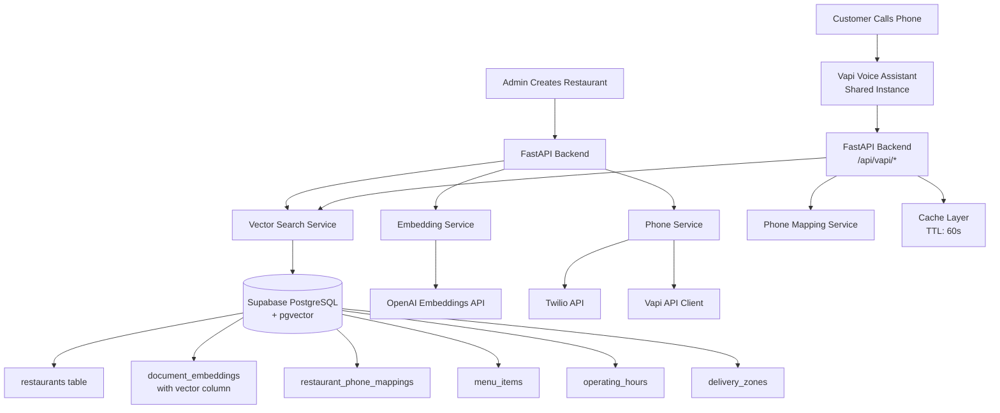
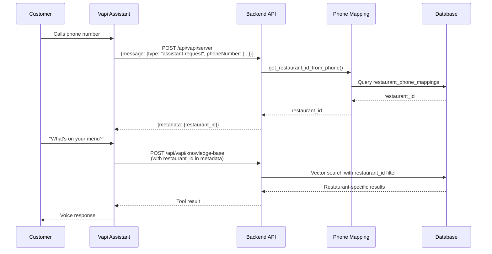
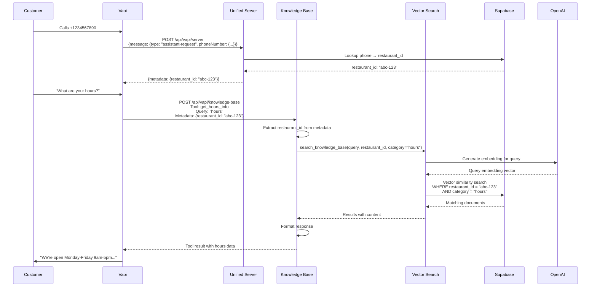
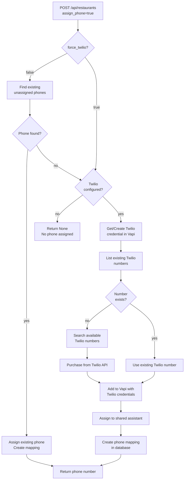
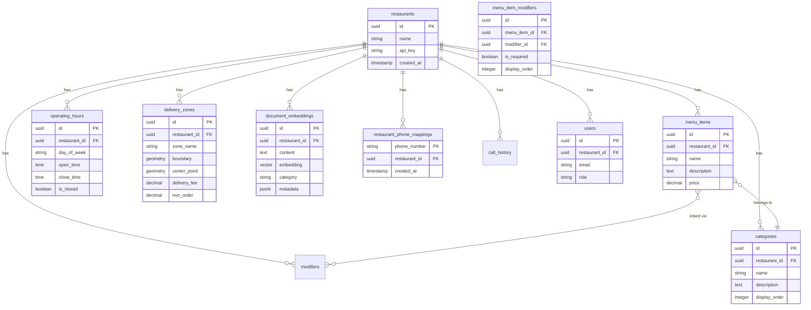

# Architecture

System architecture and design patterns for the Restaurant Voice Assistant backend.

## Overview

The system provides a multi-tenant voice assistant backend where each restaurant has isolated data but shares a single Vapi assistant instance for cost efficiency. Phone numbers are mapped to restaurants for routing.

## System Architecture

## Multi-Tenant Routing

The system uses phone number mapping to route calls to the correct restaurant:

## Voice Call Flow

Complete flow from customer call to voice response:

## Phone Assignment Flow

How phone numbers are assigned to restaurants:

## Database Schema

Key tables and relationships:

## Component Responsibilities

### FastAPI Backend (`src/main.py`)

- Main application entry point
- Middleware configuration (Auth → RequestID → CORS)
- Global exception handling
- Route registration (auth, restaurants, menu, operations, webhooks)

### Core Infrastructure (`src/core/`)

- **config.py**: Application configuration
- **logging_config.py**:
  - **Custom Formatter**: RequestIDFormatter with color-coded log levels
  - **Request Tracking**: Automatic request ID generation and propagation
  - **Color Coding**:
    - INFO: Green
    - WARNING: Yellow
    - ERROR: Red
    - DEBUG: Cyan
  - **Third-Party Suppression**: Verbose logs from external libraries suppressed
  - **Format**: `LEVEL | [module] [req=id] message`
- **middleware/request_id.py**: Request ID generation and tracking
- **middleware/auth.py**: JWT verification middleware (Supabase Auth)

### API Endpoints (`src/api/`)

- **auth.py**: User registration, login, JWT token management
- **restaurants.py**: Restaurant CRUD, phone assignment
- **categories.py**: Category CRUD operations
- **menu_items.py**: Menu items CRUD, modifier linking
- **modifiers.py**: Modifiers CRUD
- **operating_hours.py**: Operating hours management
- **delivery_zones.py**: Zone CRUD, boundary management (PostGIS), point-in-zone checks
- **vapi.py**: Vapi webhooks (unified server endpoint, knowledge-base)
- **embeddings.py**: Embedding generation, cache invalidation
- **calls.py**: Call history management (filtered messages)
- **health.py**: Health check endpoint

### Services (`src/services/`)

Services are organized by domain:

- **restaurants/service.py**: Restaurant CRUD operations
- **menu/**: Menu management
  - **items.py**: Menu items CRUD, category relationships
  - **categories.py**: Category CRUD operations
  - **item_modifiers.py**: Junction table operations (link/unlink modifiers)
- **operations/**: Business operations
  - **zones.py**: Delivery zone CRUD
  - **zone_geometry.py**: PostGIS spatial queries (boundary setting, point-in-zone)
  - **hours.py**: Operating hours management
- **phones/**: Phone management
  - **service.py**: Phone assignment orchestration
  - **mapping.py**: Phone → restaurant_id mapping
  - **twilio.py**: Twilio API integration
  - **extraction.py**: Restaurant ID extraction from various sources
- **embeddings/**: Vector embeddings
  - **service.py**: OpenAI embeddings generation, background task management
  - **search.py**: Vector similarity search
- **calls/**: Call management
  - **service.py**: Call history CRUD, message filtering
  - **parser.py**: Vapi call data parsing and transformation
  - **fetch.py**: Fetch call data from Vapi API
- **auth/**: Authentication
  - **service.py**: User registration, login business logic
- **vapi/**: Vapi integration
  - **client.py**: Vapi API client wrapper
  - **manager.py**: Resource manager (tools, assistants)
  - **response.py**: Vapi response formatting
  - **knowledge.py**: Knowledge base tool call handler
- **infrastructure/**: Core infrastructure services
  - **cache.py**: In-memory caching (TTL: 60s)
  - **database.py**: Database client (Supabase)
  - **auth.py**: Authentication utilities (dual auth support)
  - **health.py**: Health check service

### Vapi Configuration (`vapi/`)

- **config_loader.py**: YAML configuration loader
- **config/**: Tool and assistant YAML configurations

## Data Flow Patterns

### Query Processing

1. **Extract** restaurant_id from phone number or metadata
2. **Generate** embedding for user query (OpenAI)
3. **Search** vector database with restaurant_id filter (Supabase pgvector)
4. **Cache** results for 60 seconds
5. **Format** response for Vapi tool result

### Phone Assignment

1. **Check** for existing unassigned phones (unless `force_twilio=True`)
2. **Create** Twilio credential in Vapi (if needed)
3. **Purchase** phone from Twilio API (if needed)
4. **Register** phone in Vapi with credentials
5. **Assign** phone to shared assistant
6. **Create** phone mapping in database

### Multi-Tenancy Isolation

- All queries filtered by `restaurant_id`
- Row Level Security (RLS) policies in Supabase
- Service role key used for writes (bypasses RLS)
- Anon key used for reads (respects RLS)

## Embedding Generation

- **Automatic**: Background generation triggered on all data changes (POST/PUT/DELETE)
- **Async**: Non-blocking, runs after API response (doesn't delay API calls)
- **Category-Specific**: Only affected category is regenerated
- **Error Handling**: Failures logged but don't affect main request (restaurant creation still succeeds)
- **Timing**: Can take several seconds to minutes depending on data volume (runs in background)
- **Manual**: Optional `/api/embeddings/generate` endpoint for manual triggers

## Caching Strategy

- **Cache Key**: `{restaurant_id}:{category}:{query}`
- **TTL**: 60 seconds (configurable via `CACHE_TTL_SECONDS` environment variable)
- **Max Size**: 1000 entries (automatically evicts oldest when full)
- **Invalidation**: Automatic on data changes, manual via `/api/embeddings/cache/invalidate`
- **Storage**: In-memory (TTLCache from cachetools)
- **Multi-Instance Note**: For production with multiple backend instances, consider Redis for shared caching

## Call History Message Filtering

Call history messages are filtered to include only essential fields:

- **Roles**: `user`, `assistant`, `bot` (excludes `system`, `tool_calls`, `tool_call_result`)
- **Fields**: Only `role` and `content` (removes metadata, timestamps, etc.)
- Applied both during parsing (from Vapi) and retrieval (from database)

## Call Data Capture

**Webhook Reliability Issue**: Vapi webhooks are unreliable - final "ended" webhooks often don't arrive.

**Fallback Mechanism**:

- System automatically schedules an API fetch 30 seconds after detecting a call (via `status-update: ringing` or `end-of-call-report`)
- Uses Vapi API to retrieve complete call data (transcript, duration, cost)
- Ensures call history is captured even when webhooks fail
- Prevents duplicate fetches using thread-safe tracking

## Spatial Queries (PostGIS)

Delivery zones support geographic boundary definition:

- **Storage**: `boundary` column (GEOMETRY POLYGON) and `center_point` (GEOMETRY POINT)
- **Functions**: Database RPC functions for boundary setting and point-in-zone checks
- **Format**: GeoJSON (Polygon/MultiPolygon) for boundary input/output
- **Indexing**: GIST spatial indexes for efficient queries

## Security

- **Dual Authentication**: JWT (frontend users) + X-Vapi-Secret (webhooks/admin)
- **JWT Verification**: Supabase Auth middleware verifies tokens automatically
- **Restaurant Access Control**: JWT users can only access their own restaurant's data
- **Vapi Webhooks**: Verified via `X-Vapi-Secret` header
- **Database**: RLS policies for multi-tenant isolation
- **Service Role**: Only used for admin operations (writes)

## Cost Optimization

- **Single Vapi Assistant**: Shared across all restaurants
- **Phone Reuse**: Assigns existing phones before creating new ones
- **Caching**: Reduces OpenAI embedding API calls (60s TTL)
- **Vector Search**: Efficient pgvector indexing (HNSW)
- **Spatial Indexing**: GIST indexes for PostGIS queries

## Scalability Considerations

- **Horizontal Scaling**: Stateless FastAPI app, can run multiple instances
- **Database**: Supabase scales PostgreSQL automatically
- **Caching**: Consider Redis for multi-instance deployments (currently in-memory per instance)
- **Phone Limits**: Twilio account quotas apply per restaurant
- **Background Tasks**: FastAPI BackgroundTasks run per-instance (consider Celery for distributed tasks)
- **Webhook Reliability**: Uses 30-second delayed API fetch fallback (thread-based, works per-instance)
