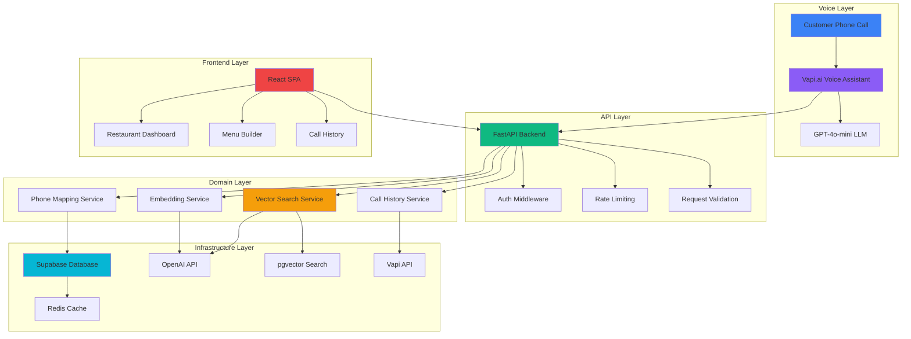
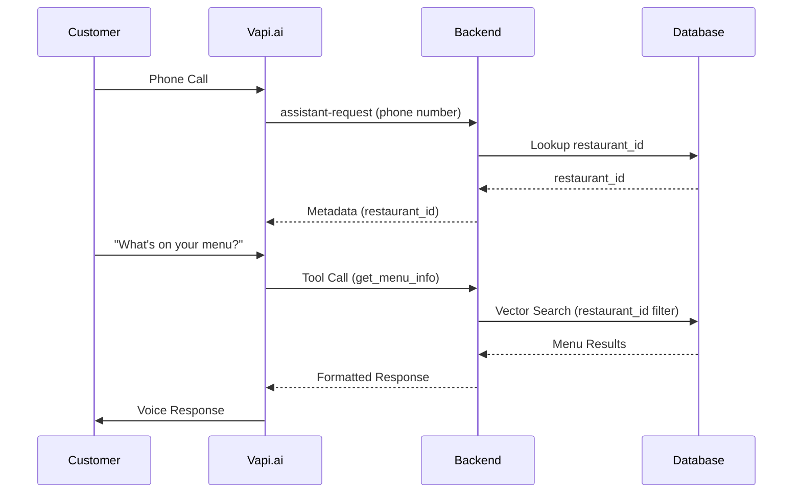
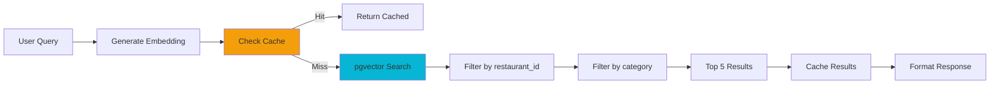

# CallEats Architecture

This document describes the system architecture, data flows, and key design decisions for CallEats.

## System Overview

CallEats is a multi-tenant voice assistant system for restaurants. The architecture consists of:

- **FastAPI Backend**: REST API with async support, middleware stack, and domain-driven design
- **Vapi.ai Integration**: Voice assistant platform handling phone calls and conversation
- **Supabase Database**: PostgreSQL with pgvector extension for vector similarity search
- **React Frontend**: TypeScript SPA for restaurant management dashboard
- **Redis Cache**: Distributed caching with in-memory fallback
- **Sentry Monitoring**: Error tracking and performance monitoring

## Architecture Diagram



## Multi-Tenant Design

### Tenant Isolation

All data is scoped by `restaurant_id`:

- **Database Level**: Row-level security (RLS) policies in Supabase
- **Application Level**: All queries filter by `restaurant_id`
- **Vector Search**: Restaurant-scoped embeddings with metadata filtering
- **Cache Keys**: Include `restaurant_id` in cache key structure

### Phone Number Routing

Shared Vapi.ai assistant instance routes calls using phone number mapping:

1. Customer calls restaurant phone number
2. Vapi.ai sends `assistant-request` webhook with phone number
3. Backend looks up `restaurant_id` from `restaurant_phone_mappings` table
4. Restaurant metadata injected into Vapi context
5. All subsequent tool calls include `restaurant_id` for data isolation

## Voice Assistant Integration

### Vapi.ai Workflow



### Function Tools

Four function tools map to content categories:

- `get_menu_info` → `category: "menu"`
- `get_modifiers_info` → `category: "modifiers"`
- `get_hours_info` → `category: "hours"`
- `get_zones_info` → `category: "zones"`

### Tool Call Processing

1. **Query Extraction**: Parse user query from Vapi request (supports multiple formats)
2. **Restaurant ID Resolution**: Extract from header, query param, metadata, or phone lookup
3. **Category Mapping**: Map tool name to content category
4. **Vector Search**: Perform semantic search with restaurant_id filter
5. **Response Formatting**: Return structured results with metadata for TTS enhancement

## Vector Search Pipeline

### Embedding Generation

Menu items, modifiers, hours, and zones are converted to embeddings:

```python
# Example: Menu item embedding
content = f"{item['name']} - {item['description']} - ${item['price']}"
embedding = await generate_embedding(content)  # OpenAI text-embedding-3-small
```

Embeddings stored in `document_embeddings` table with:

- `restaurant_id`: Tenant isolation
- `category`: Content type (menu, modifiers, hours, zones)
- `content`: Searchable text
- `metadata`: Original record data (JSONB)
- `embedding`: Vector (1536 dimensions)

### Search Flow



### Search Function

PostgreSQL function performs cosine similarity search:

```sql
CREATE FUNCTION search_documents(
    query_embedding vector(1536),
    query_restaurant_id uuid,
    query_category text DEFAULT NULL,
    match_count int DEFAULT 5
)
RETURNS TABLE (content text, metadata jsonb, similarity float)
```

Uses HNSW index for fast similarity search:

```sql
CREATE INDEX idx_document_embeddings_vector
ON document_embeddings
USING hnsw (embedding vector_cosine_ops);
```

## Call Management

### Webhook Events

Vapi.ai sends three webhook event types:

1. **assistant-request**: Maps phone number to restaurant_id
2. **status-update**: Monitors call status (ringing, in-progress, ended)
3. **end-of-call-report**: Triggers call data retrieval

### Fallback Mechanism

Webhooks are unreliable—final "ended" webhooks often don't arrive. System implements fallback:

1. **Status Detection**: On "ringing" status, schedule API fetch after 30 seconds
2. **Background Thread**: Daemon thread fetches call data from Vapi API
3. **Duplicate Prevention**: Thread-safe tracking prevents duplicate fetches
4. **Complete Data**: Ensures call transcripts, duration, cost are captured

### Call Data Storage

Call history stored in `call_history` table:

- `restaurant_id`: Tenant isolation
- `started_at`, `ended_at`: Call timestamps
- `duration_seconds`: Calculated duration
- `caller`: Phone number (normalized)
- `outcome`: Call outcome (completed, failed, etc.)
- `messages`: Filtered transcript (user/assistant only)
- `cost`: Total call cost

## Caching Strategy

### Cache Architecture

Two-tier caching with graceful fallback:

1. **Redis** (preferred): Distributed cache across server instances
2. **In-Memory** (fallback): TTLCache for development/single-instance

### Cache Keys

- **Search Results**: `cache:{restaurant_id}:{category}:{query}`
- **Call Mappings**: `call_phone:{call_id}`

### Cache TTL

- **Search Results**: 60 seconds (configurable via `CACHE_TTL_SECONDS`)
- **Call Mappings**: 1 hour (fixed)

### Cache Invalidation

Automatic invalidation on data changes:

- Menu item update → Clear `cache:{restaurant_id}:menu:*`
- Modifier update → Clear `cache:{restaurant_id}:modifiers:*`
- Hours update → Clear `cache:{restaurant_id}:hours:*`
- Zone update → Clear `cache:{restaurant_id}:zones:*`

## Middleware Stack

FastAPI middleware applied in order:

1. **RequestIDMiddleware**: Generates unique request IDs for tracing
2. **ValidationMiddleware**: Validates request size and format
3. **TimeoutMiddleware**: Global request timeout (30s default)
4. **AuthMiddleware**: JWT validation for frontend, X-Vapi-Secret for webhooks
5. **SlowAPIMiddleware**: Rate limiting (user-based and endpoint-based)
6. **CORSMiddleware**: CORS configuration
7. **SecurityHeadersMiddleware**: Security headers (CSP, HSTS, etc.)

## Frontend Architecture

### Component Structure

```
src/
├── pages/           # Route pages (Dashboard, MenuBuilder, CallHistory)
├── components/      # Reusable components
│   ├── common/      # Shared components (Button, Modal, Toast)
│   ├── layout/      # Layout components (Layout, Sidebar, Header)
│   ├── menu/        # Menu-specific components
│   └── dashboard/   # Dashboard-specific components
├── features/        # Feature-specific hooks and utilities
├── api/             # API client functions
├── contexts/        # React contexts (Auth, Toast, Sidebar)
└── hooks/           # Custom React hooks
```

### State Management

- **React Query**: Server state, caching, background refetching
- **React Context**: Auth state, toast notifications, sidebar state
- **Local State**: Component-specific state with `useState`

### API Client

Centralized API client with:

- Base URL configuration
- Request/response interceptors
- Error handling
- Authentication token injection
- Request ID tracking

## Database Schema

### Core Tables

- `restaurants`: Tenant table with API keys
- `restaurant_phone_mappings`: Phone number → restaurant_id mapping
- `categories`: Menu categories with display ordering
- `menu_items`: Menu items with prices, descriptions, images
- `modifiers`: Add-ons and extras
- `menu_item_modifiers`: Many-to-many junction table
- `operating_hours`: Day-of-week scheduling
- `delivery_zones`: Geographic zones with fees
- `document_embeddings`: Vector embeddings for semantic search
- `call_history`: Call records with transcripts

### Indexes

- Restaurant-scoped indexes on all tenant tables
- HNSW vector index on `document_embeddings.embedding`
- Composite indexes for common query patterns

### Row-Level Security

All tables have RLS enabled with policies:

- **Service Role**: Full access (backend operations)
- **Authenticated Users**: Read access (frontend queries)
- **Anonymous**: No access (except public endpoints)

## Security

### Authentication

- **Frontend**: JWT tokens from Supabase Auth
- **Webhooks**: X-Vapi-Secret header validation
- **Dual Auth**: Separate auth paths for frontend and webhooks

### Authorization

- **Tenant Isolation**: All queries filter by `restaurant_id`
- **RLS Policies**: Database-level access control
- **User-Restaurant Mapping**: Users associated with restaurants via `users` table

### Data Protection

- **Request Validation**: Size limits, format validation
- **Rate Limiting**: Per-user and per-endpoint limits
- **Timeout Protection**: Global request timeout
- **Security Headers**: CSP, HSTS, X-Frame-Options

## Error Handling

### Exception Hierarchy

Custom exceptions with appropriate HTTP status codes:

- `NotFoundError` → 404
- `AuthenticationError` → 401
- `ValidationError` → 400
- `VapiAPIError` → 502
- `RestaurantVoiceAssistantError` → 500

### Error Tracking

- **Sentry Integration**: Automatic error capture with context
- **Request ID Tracking**: All errors include request ID for tracing
- **User Context**: Sentry user context from JWT token

## Performance Optimizations

### Backend

- **Async Operations**: FastAPI async/await for I/O-bound operations
- **Connection Pooling**: Supabase client connection pooling
- **Background Tasks**: Embedding generation in background
- **Caching**: Redis/in-memory cache for search results

### Frontend

- **Code Splitting**: Route-based code splitting with React Router
- **Lazy Loading**: Dynamic imports for heavy components
- **React Query**: Automatic background refetching and caching
- **Optimistic Updates**: Immediate UI updates with rollback on error

### Database

- **Indexes**: Strategic indexes for common query patterns
- **HNSW Index**: Fast vector similarity search
- **Connection Pooling**: Supabase connection pooling
- **Query Optimization**: Efficient queries with proper filtering

## Deployment

### Backend (Railway)

- **Runtime**: Python 3.12
- **Process**: Uvicorn ASGI server
- **Environment Variables**: Loaded from Railway secrets
- **Health Checks**: `/api/health` endpoint

### Frontend (Vercel)

- **Build**: Vite production build
- **Static Assets**: CDN-hosted assets
- **Environment Variables**: Vercel environment variables
- **Routing**: Client-side routing with React Router

### Database (Supabase)

- **PostgreSQL**: Managed PostgreSQL with pgvector
- **Migrations**: SQL migration files applied in order
- **Backups**: Automatic daily backups
- **Monitoring**: Supabase dashboard for query performance

## Monitoring & Observability

### Error Tracking

- **Sentry**: Error capture with stack traces, user context, request context
- **Error Filtering**: Common non-critical errors filtered out
- **Environment Tagging**: Errors tagged with environment (development/production)

### Logging

- **Structured Logging**: JSON-formatted logs with request IDs
- **Log Levels**: DEBUG, INFO, WARNING, ERROR
- **Request Tracing**: Request IDs propagated through all layers

### Health Checks

- **Backend Health**: `/api/health` endpoint with database connectivity check
- **Frontend Health**: Vercel deployment status
- **Database Health**: Supabase connection status

## Future Enhancements

Potential improvements:

1. **Real-Time Updates**: WebSocket support for live call monitoring
2. **Analytics Dashboard**: Call analytics, query patterns, performance metrics
3. **Multi-Language Support**: Internationalization for voice assistant
4. **Order Integration**: Connect to POS systems for order placement
5. **Advanced Analytics**: Query intent analysis, customer sentiment
6. **A/B Testing**: Test different prompts and responses
7. **Custom Voices**: Restaurant-specific voice customization
