# CallEats Architecture

System architecture, data flows, and design decisions.

## System Overview

Multi-tenant voice assistant system with:

- **FastAPI Backend**: REST API with async support and middleware stack
- **Vapi.ai**: Voice assistant platform for phone calls
- **Supabase**: PostgreSQL with pgvector for vector search
- **React Frontend**: TypeScript SPA dashboard
- **Redis Cache**: Distributed caching with in-memory fallback
- **Sentry**: Error tracking and monitoring

## Architecture Diagram

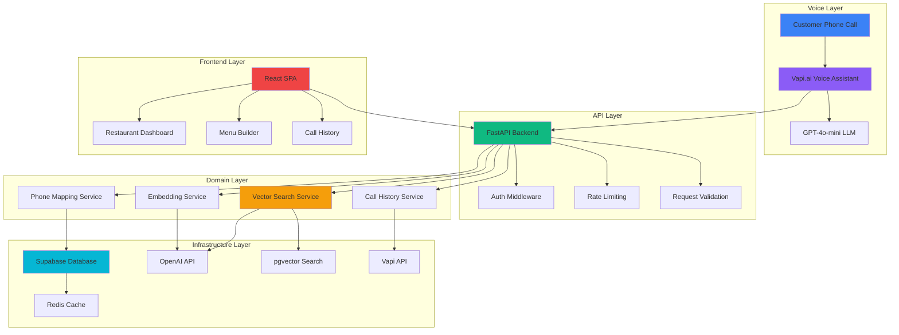

## Multi-Tenant Design

### Tenant Isolation

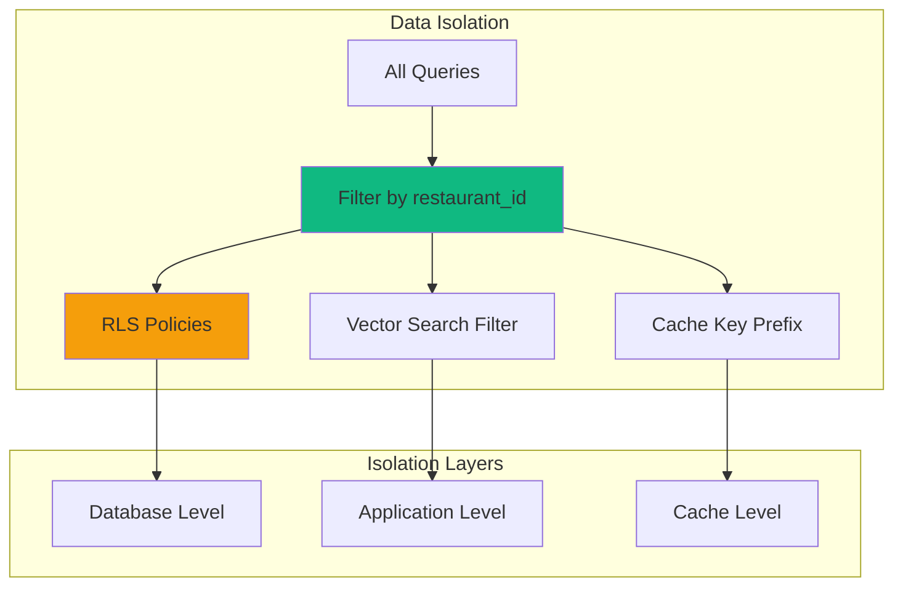

All data scoped by `restaurant_id`:
- **Database**: RLS policies in Supabase
- **Application**: All queries filter by `restaurant_id`
- **Vector Search**: Restaurant-scoped embeddings
- **Cache**: `restaurant_id` in cache keys

### Phone Number Routing

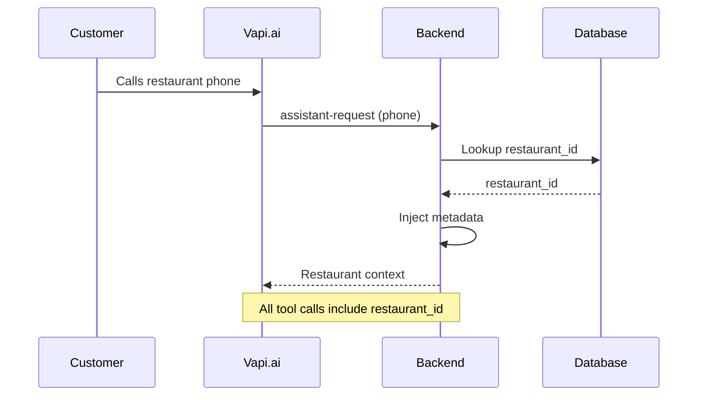

Shared Vapi.ai assistant routes calls via phone number → `restaurant_id` mapping.

## Voice Assistant Integration

### Vapi.ai Workflow

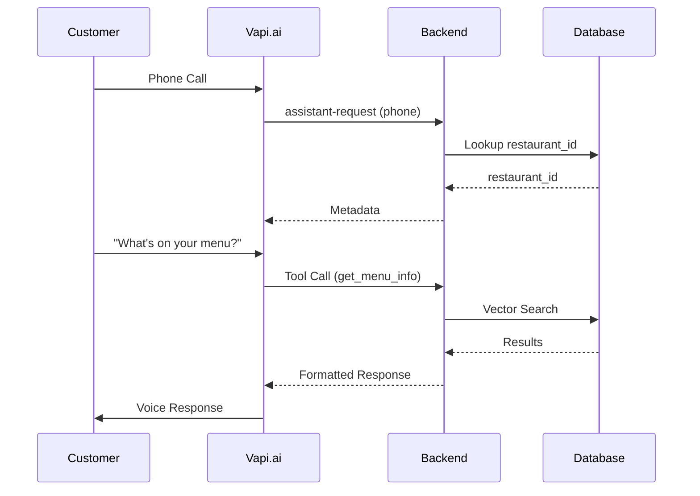

### Function Tools

| Tool | Category | Purpose |
|------|----------|---------|
| `get_menu_info` | menu | Menu items and descriptions |
| `get_modifiers_info` | modifiers | Add-ons and extras |
| `get_hours_info` | hours | Operating hours |
| `get_zones_info` | zones | Delivery zones and fees |

### Tool Call Processing

1. Extract query from Vapi request
2. Resolve `restaurant_id` (header/query/metadata/phone)
3. Map tool name → category
4. Vector search with `restaurant_id` filter
5. Format response with metadata for TTS

## Vector Search Pipeline

### Embedding Generation

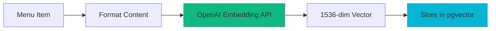

Content format: `"{name} - {description} - ${price}"`

Stored in `document_embeddings`:
- `restaurant_id`, `category`, `content`, `metadata` (JSONB), `embedding` (1536d)

### Search Flow

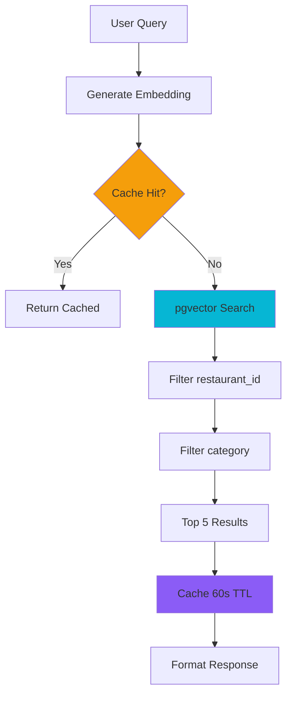

### Search Function

PostgreSQL function with HNSW index:

```sql
CREATE FUNCTION search_documents(
    query_embedding vector(1536),
    query_restaurant_id uuid,
    query_category text DEFAULT NULL,
    match_count int DEFAULT 5
) RETURNS TABLE (content text, metadata jsonb, similarity float);

CREATE INDEX idx_document_embeddings_vector
ON document_embeddings USING hnsw (embedding vector_cosine_ops);
```

## Call Management

### Webhook Events & Fallback

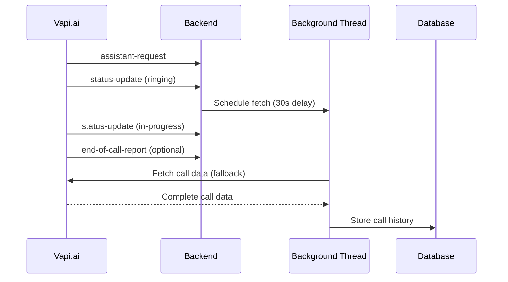

**Webhook Events**: `assistant-request`, `status-update`, `end-of-call-report`

**Fallback**: Background thread fetches call data 30s after "ringing" status to ensure complete data capture.

### Call Data Storage

`call_history` table: `restaurant_id`, `started_at`, `ended_at`, `duration_seconds`, `caller`, `outcome`, `messages` (filtered transcript), `cost`

## Caching Strategy

### Cache Architecture

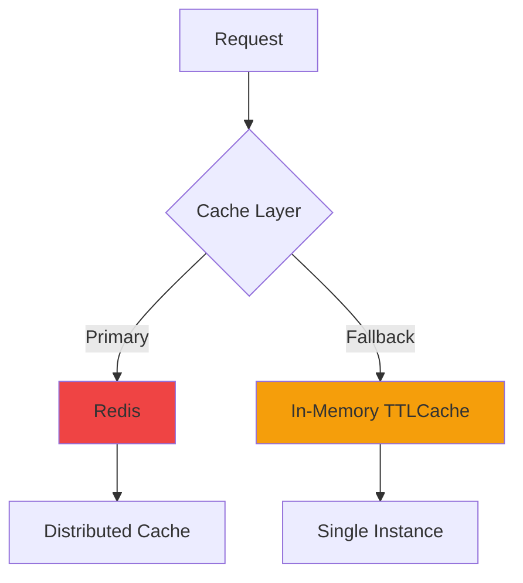

Two-tier: Redis (distributed) → In-Memory (fallback)

### Cache Keys & TTL

| Key Pattern | TTL | Purpose |
|------------|-----|---------|
| `cache:{restaurant_id}:{category}:{query}` | 60s | Search results |
| `call_phone:{call_id}` | 1h | Call mappings |

### Cache Invalidation

Automatic on data changes:
- Menu update → Clear `cache:{restaurant_id}:menu:*`
- Modifier update → Clear `cache:{restaurant_id}:modifiers:*`
- Hours update → Clear `cache:{restaurant_id}:hours:*`
- Zone update → Clear `cache:{restaurant_id}:zones:*`

## Middleware Stack

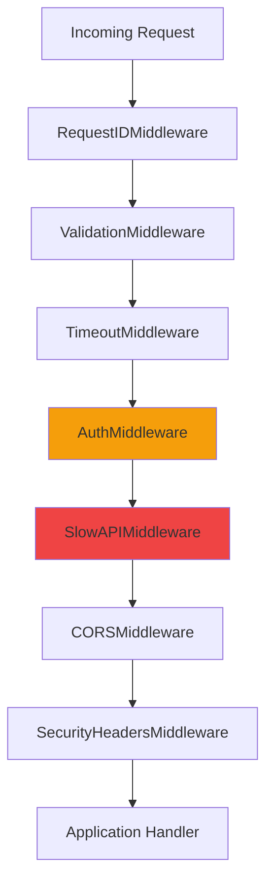

Applied in order: Request ID → Validation → Timeout (30s) → Auth (JWT/Secret) → Rate Limiting → CORS → Security Headers

## Frontend Architecture

### Component Structure

```
src/
├── pages/          # Route pages
├── components/     # Reusable components
│   ├── common/     # Button, Modal, Toast
│   ├── layout/     # Layout, Sidebar, Header
│   ├── menu/       # Menu components
│   └── dashboard/  # Dashboard components
├── features/       # Feature hooks/utilities
├── api/            # API client
├── contexts/       # Auth, Toast, Sidebar
└── hooks/          # Custom hooks
```

### State Management

- **React Query**: Server state, caching, background refetch
- **React Context**: Auth, toast, sidebar state
- **Local State**: Component-specific `useState`

### API Client

Centralized client: base URL, interceptors, error handling, auth token injection, request ID tracking.

## Database Schema

### Core Tables

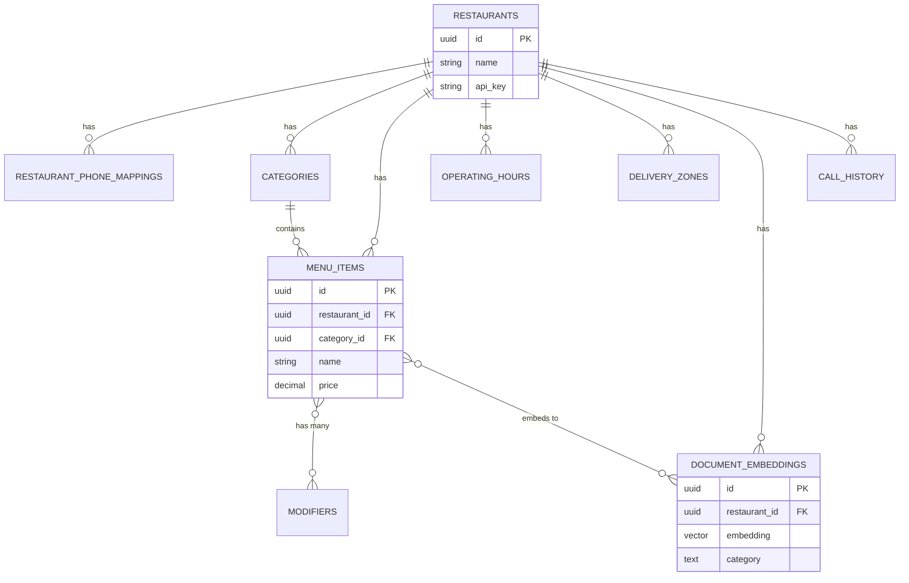

**Core Tables**: `restaurants`, `restaurant_phone_mappings`, `categories`, `menu_items`, `modifiers`, `menu_item_modifiers`, `operating_hours`, `delivery_zones`, `document_embeddings`, `call_history`

**Indexes**: Restaurant-scoped indexes, HNSW vector index, composite indexes

**RLS**: All tables with policies (Service Role: full access, Authenticated: read, Anonymous: none)

## Security

### Authentication

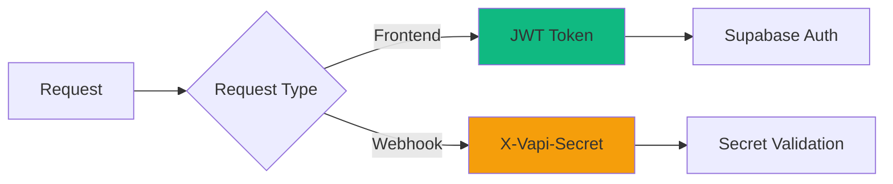

- **Frontend**: JWT tokens from Supabase Auth
- **Webhooks**: X-Vapi-Secret header validation

### Authorization & Protection

- **Tenant Isolation**: All queries filter by `restaurant_id`
- **RLS Policies**: Database-level access control
- **Rate Limiting**: Per-user and per-endpoint
- **Request Validation**: Size limits, format validation
- **Security Headers**: CSP, HSTS, X-Frame-Options

## Error Handling

### Exception Hierarchy

| Exception | Status Code |
|-----------|-------------|
| `NotFoundError` | 404 |
| `AuthenticationError` | 401 |
| `ValidationError` | 400 |
| `VapiAPIError` | 502 |
| `RestaurantVoiceAssistantError` | 500 |

### Error Tracking

Sentry integration with request ID tracking and user context from JWT.

## Performance Optimizations

**Backend**: Async operations, connection pooling, background tasks, caching

**Frontend**: Code splitting, lazy loading, React Query caching, optimistic updates

**Database**: Strategic indexes, HNSW vector index, connection pooling, query optimization

## Deployment

| Service | Platform | Details |
|---------|----------|---------|
| Backend | Railway | Python 3.12, Uvicorn, `/api/health` endpoint |
| Frontend | Vercel | Vite build, CDN assets, client-side routing |
| Database | Supabase | PostgreSQL + pgvector, SQL migrations, daily backups |

## Monitoring & Observability

**Error Tracking**: Sentry with stack traces, user context, request context, environment tagging

**Logging**: Structured JSON logs with request IDs, log levels (DEBUG/INFO/WARNING/ERROR)

**Health Checks**: Backend `/api/health` (DB connectivity), Frontend (Vercel status), Database (Supabase status)

## Future Enhancements

1. Real-time updates via WebSocket for live call monitoring
2. Analytics dashboard with call analytics and query patterns
3. Multi-language support for voice assistant
4. Order integration with POS systems
5. Advanced analytics: intent analysis, sentiment
6. A/B testing for prompts and responses
7. Custom voices per restaurant
